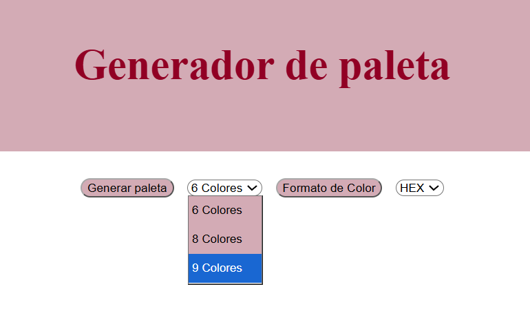
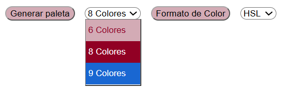
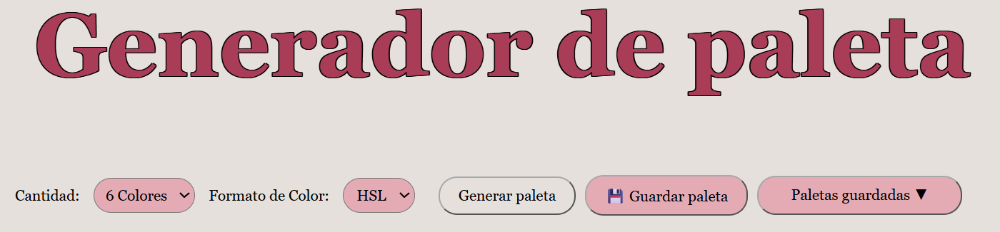
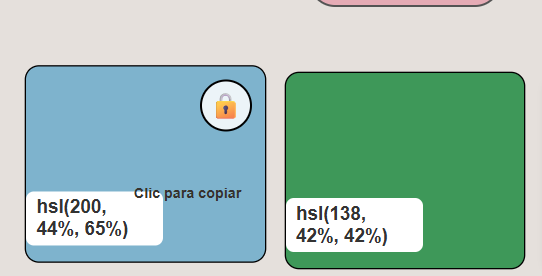
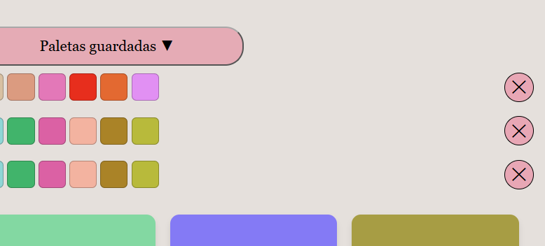
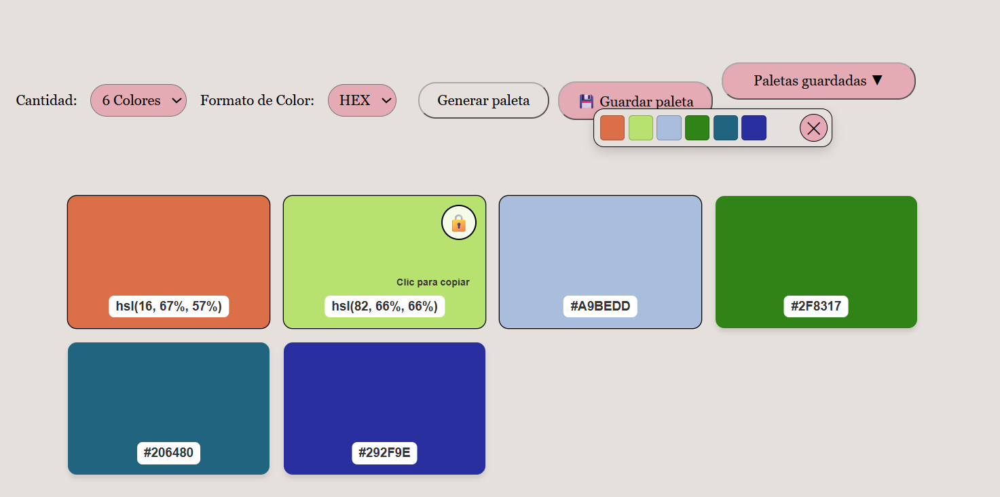

## Imagen de estructura inicial

Está imagen es la referencia de la estructura inicial de la App solo con HTML y CSS 

## Cambio de estilos 

Está imagen refleja el cambio de estilos, queria mejorar el color por defecto al selecionar 

>Nota:Este cambio no fue realizado, pero se cambio el color de el menú desplegable 

## Estilo definido
 
 En esta imagen se ve el estilo definido, y también los controles que fueron añadidos como: Guardad Paleta y El menú desplegable 

##  Bloqueo de color añadido  en la paleta 

 Añadí la opción de bloquear color y así se veía al inicio, despues este fue modificado 

 

## Mejora de menú desplegables
 
 Mejoramos el menú desplegable de paletas guardadas, aparecían 5 por defecto y no podían ser eliminadas, despues esto fue mejorado 

 

 ## Imagen de Funcionamiento con cambios y resultado final 

  

  [Volver ](../Documentacion/README.md)

