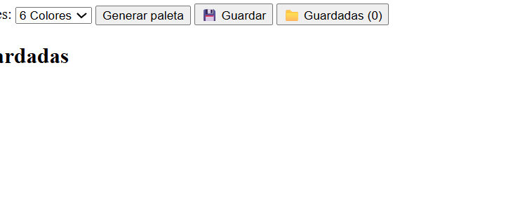
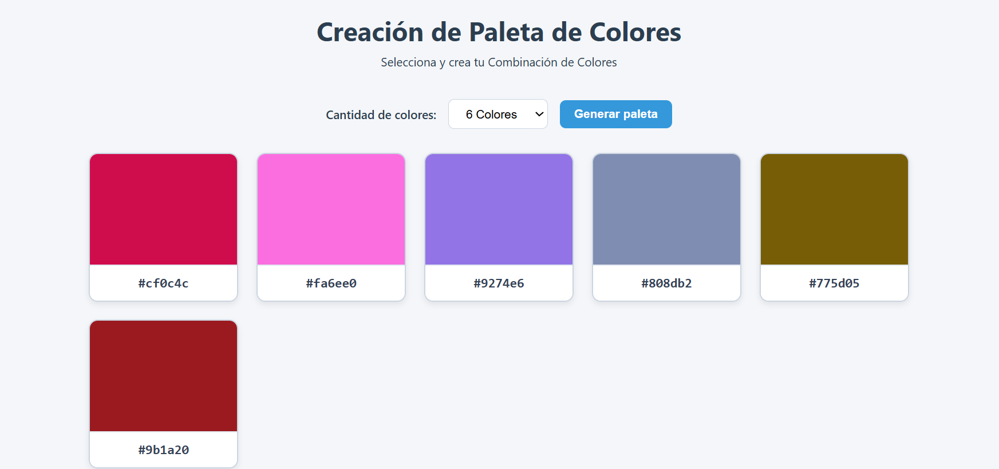
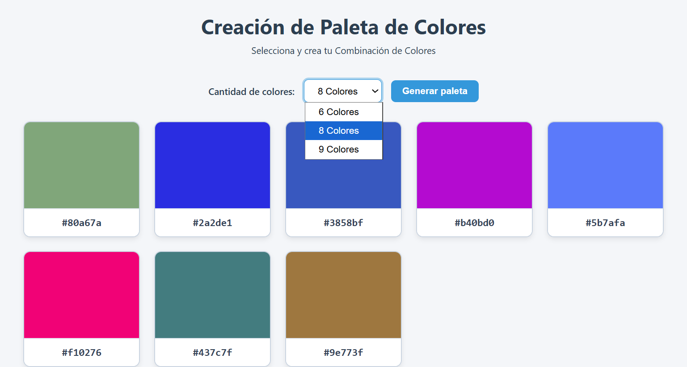
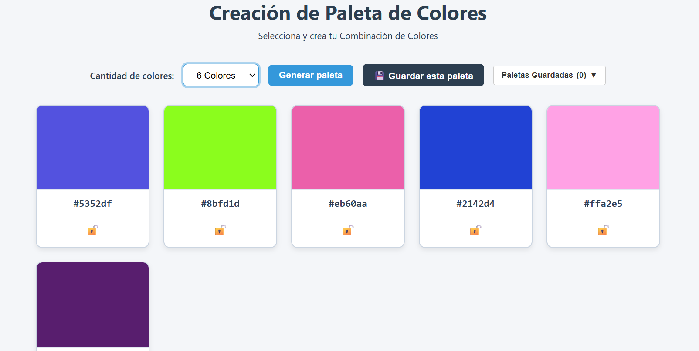
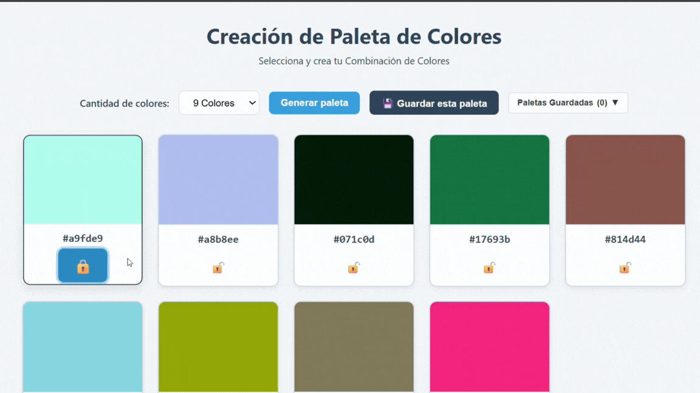
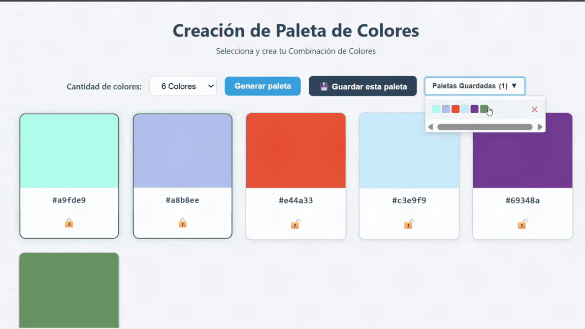
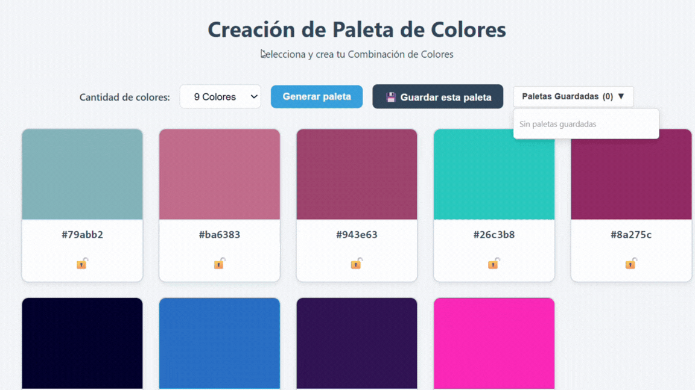

Colorfly 
— Generador de Paletas de ColoresUna aplicación web interactiva, 
moderna e intuitiva diseñada para crear, gestionar y personalizar 
paletas de colores armónicas en tiempo real. Permite bloquear colores preferidos,
 alternar formatos, copiar códigos al portapapeles y almacenar combinaciones 
 favoritas en un menú compacto.
 🌟 Características Principales
  🎲 Generación Aleatoria Dinámica: 
   Crea combinaciones de colores vibrantes con un solo clic.
  📐 Tamaño de Paleta Personalizable:
   Elige entre 6, 8 o 9 colores según las necesidades de tu diseño.
  🔒 Bloqueo Selectivo de Colores (Candados):
   Congela tus colores favoritos (🔒) para conservarlos 
   mientras sigues generando nuevos tonos en las tarjetas desprotegidas.
  📋 Copia al Portapapeles con Microfeedback:
    Haz clic en cualquier muestra o código cromático para copiar el valor 
    al portapapeles con confirmación visual en pantalla ("¡Copiado!").
  📁 Gestión Compacta de Paletas Guardadas: Guarda tus paletas completas en
   un menú desplegable (dropdown) con contador dinámico (N),
    vista previa en miniaturas y opción para eliminar individualmente (✕).
  ⚡ Transiciones y Animaciones Sutiles: Microinteracciones visuales en botones,
   animación de entrada para tarjetas (tarjeta-animada) y despliegue suave de listas.
  🛠️ Tecnologías UtilizadasHTML5 Semántico: Estructura limpia y accesible (<header>, 
  <main>, <section>, <article>, <footer>).CSS3 Moderno: Flexbox/Grid, variables,
   animaciones con @keyframes y efectos de hover.JavaScript (ES6+):
    Manipulación dinámica del DOM, eventos asíncronos y uso de la API navigator.clipboard.
  🚀 Evolución del Proyecto y Avances VisualesEl desarrollo del proyecto pasó por un proceso
   de refinamiento visual y funcional para optimizar la experiencia de usuario (UX):
   1. Primera Fase: Prototipo BaseEn la etapa inicial, la aplicación contaba con una 
   interfaz básica y la lista de paletas guardadas ocupaba espacio permanente en la pantalla principal.
   Vista InicialInteracción BásicaEstructura InicialDiseño inicial sin refinamiento de controlesLista 
   de guardadas fija en pantallaBotones independientes de guardado.
   2. Segunda Fase: Rediseño y Mejoras NotablesSe consolidó la interfaz integrando
    un único botón con menú desplegable, animaciones de entrada y feedback táctil al copiar
     o bloquear elementos.
    3. Interfaz Final LimpiaMenú Desplegable ActivoFeedback y BloqueoControles organizados
     y tarjetas animadasDesplegable con minilista y eliminaciónCopiar al portapapeles y estado
      de candados
 📖 Flujo de Uso de la AplicaciónSeleccionar tamaño:
   Escoge la cantidad de tarjetas en el menú desplegable (6, 8 o 9).Generar colores:
    Presiona el botón "Generar paleta".Bloquear favoritos: 
    Haz clic en el ícono del candado (🔓 ➔ 🔒) en los colores que quieras mantener.
    Copiar código: Haz clic sobre cualquier muestra de color o texto para copiar el código.
    Guardar combinación: Haz clic en "💾 Guardar" para almacenar la paleta completa.
    Consultar o eliminar: Haz clic en "📁 Guardadas (N)" para abrir la lista, cargar 
    una paleta anterior o borrarla con la opción ✕.
    📂 Estructura del ProyectoPlaintext├── index.html        # Estructura semántica de la app

Imagenes del proceso de la app

 
 Estructura inicial y posible error de ruta con styles y JavaScript.

   Imagen de app con estilos, y boton de GENERAR paleta (errrores corregidos).

 Selecion de tamaño para generar colores (6,8,9).

Botones incluidos: Guardar paleta, Menú desplegable para colsultar paletas o elimianr, Iconó de bloqueo de color.

 
 Botones de generación de paleta de colores y bloqueo de colores.

 Menú desplegable y eliminación de paletas guardadas.

 Función de copiado de código de color.